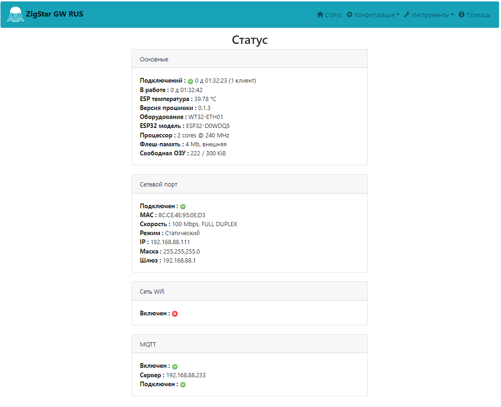
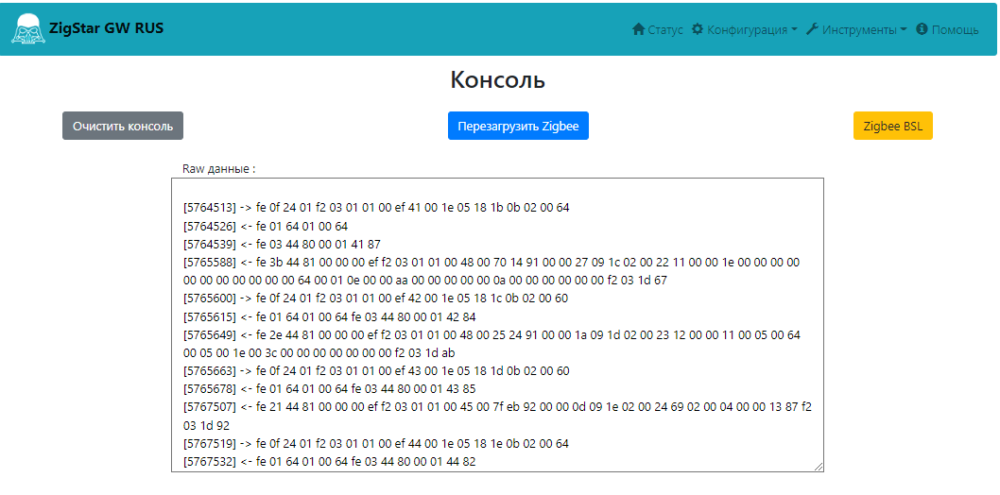
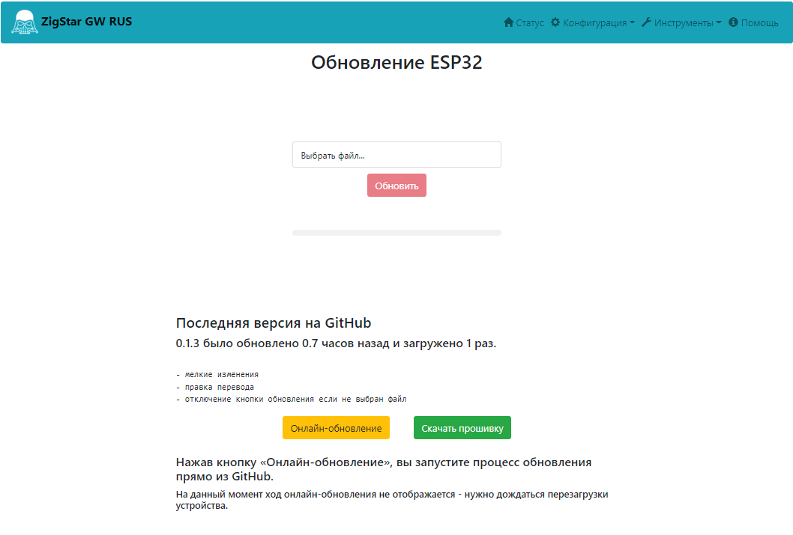
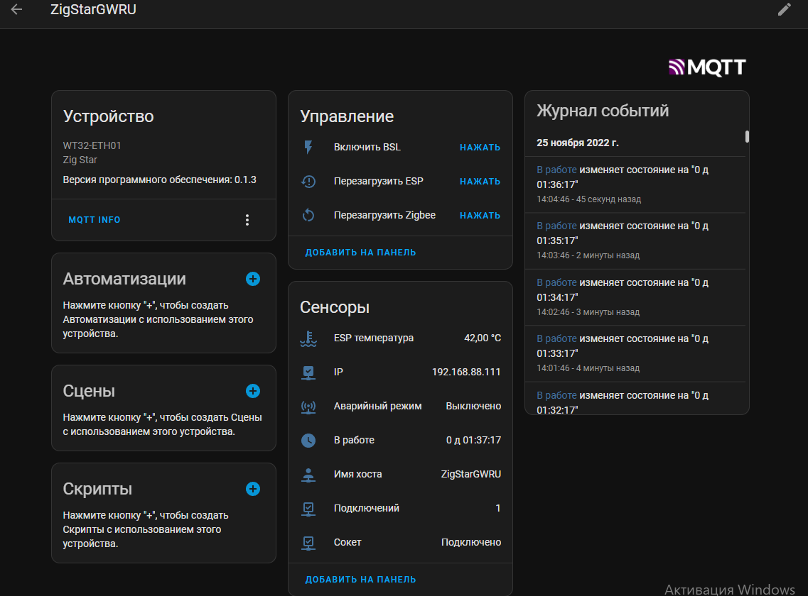

# ZigStar LAN Gateway - Firmware RUS (Русская версия)

Оригинальный проект [ZigStar LAN Gateway](https://github.com/xyzroe/ZigStarGW-FW)

## Изменения
- удалены политические лозунги
- переведен интерфейс на русский язык (в работе)
- проверка кода на закладки

## Прошивки

* **ZigStarGWRUS.bin** - для обновления по воздуху
* **ZigStarGWRUS_v0.1.0.full.bin** - полная версия с загрузчиком. Для прошивки с нуля.

## Важно
Проходит тестирования после внесения изменений

### Заметки
____
+ Прописанные платы в коде:
    - **WT32-ETH01** - тип 1 (используется по умолчанию)
    - **TTGO T-Internet-POE** - тип 2
    - **China-GW** - тип 3
    - **Omilex EPS32-POE** - тип 4 

Тип платы прописывается в system.json параметр board.\
Если это первая заливка и плата не WT32-ETH01 надо менять system.json
____

## Скриншоты

